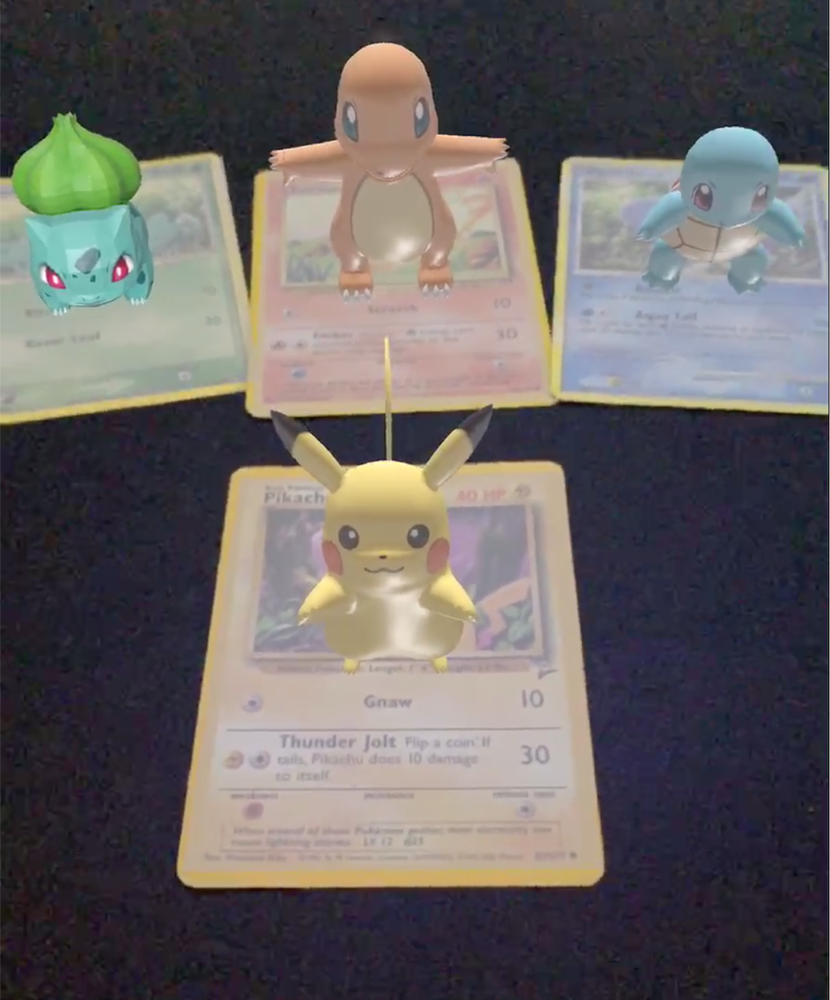

# Poke Cards 3D
View Pokemon Trading card game monster as 3D Model in real space.

## What is created
Using pokemon cards app will show a 3D model of the Pokemon in AR. Pokemons' 3D Model must have been set and also pre input trading card, as hard coded assets. Be able to track the real world trading card plane and generate the 3D model of the monster ontop of the card.

## What is learned
* How to setup base ARKit2 Project
* How to track a card.
* Setup a flat plane ontop of a card, while tracking movement.
* Setup a 3D Model for a pokemon
* Generate 3D Model ontop of trading card in AR

## Finished App
 
